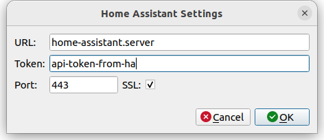

## How to use this fork

Unlike Streamdeck UI, this fork is not available via PIP so you have to clone or download this repository, e.g. with
> git clone https://github.com/Gensyn/streamdeck-ui-hass.git

Install all requirements:
> pip install -r /path/to/streamdeck-ui-hass/requirements.txt

For all paths to resolve correctly you need to add the folder to your python path. You can start the application like this:
> PYTHONPATH=$PYTHONPATH:/path/to/streamdeck-ui-hass python3 /path/to/streamdeck-ui-hass/streamdeck_ui_hass/__main__.py

Instead of updating the python path every time manually, instead you can add the update to the `.bashrc` file in your home folder:
> PYTHONPATH=$PYTHONPATH:/path/to/streamdeck-ui-hass

The config file structure of this fork is not compatible with the original Streamdeck UI, so you will find no buttons configured on your first start (your config for the original Streamdeck UI will remain untouched).

In the menu bar you will find a new entry "Settings" with only one option: "Home Assistant":


Clicking on "Home Assistant" will open a settings window:



Enter your server's address and your [long-lived access token for Home Assistant](https://developers.home-assistant.io/docs/auth_api/#long-lived-access-token) as well as your port and whether to use SSL.
You need to have `websocket_api` enabled in your Home Assistant configuration!
On clicking "OK" the connection is established and if successful, new options for buttons appear:


First you need to select a domain, afterwards you can select an entity and a service for this domain. If your entity has a custom icon it is automatically set as the buttons icon. Streamdeck UI HASS also trys to interpret the entity's state as either "on" or "off". The state "on" gets a yellow icon, "off" is gray. Entities from the domain "media_player" get a special treatment: the icon is also based on the selected service.

## Original Streamdeck UI

[](https://timothycrosley.github.io/streamdeck-ui/)
_________________

[](http://badge.fury.io/py/streamdeck-ui)
[](https://github.com/timothycrosley/streamdeck-ui/actions?query=workflow%3ATest)
[](https://codecov.io/gh/timothycrosley/streamdeck-ui)
[](https://gitter.im/timothycrosley/streamdeck-ui?utm_source=badge&utm_medium=badge&utm_campaign=pr-badge&utm_content=badge)
[](https://pypi.python.org/pypi/streamdeck-ui/)
[](https://pepy.tech/project/streamdeck-ui)
[](https://github.com/psf/black)
[](https://timothycrosley.github.io/isort/)
 
_________________

[Read Latest Documentation](https://timothycrosley.github.io/streamdeck-ui/) 
[Release notes](CHANGELOG.md) 
_________________

**streamdeck_ui** A Linux compatible UI for the Elgato Stream Deck.


## Key Features

* **Linux Compatible**: Enables usage of Stream Deck devices (Original, MK2, Mini and XL) on Linux.
* **Multi-device**: Enables connecting and configuring multiple Stream Decks on one computer.
* **Brightness Control**: Supports controlling the brightness from both the configuration UI and buttons on the device itself.
* **Configurable Button Display**: Icons + Text, Icon Only, and Text Only configurable per button on the Stream Deck.
* **Multi-Action Support**: Run commands, write text and press hotkey combinations at the press of a single button on your Stream Deck.
* **Button Pages**: streamdeck_ui supports multiple pages of buttons and dynamically setting up buttons to switch between those pages.
* **Auto Reconnect**: Automatically and gracefully reconnects, in the case the device is unplugged and replugged in.
* **Import/Export**: Supports saving and restoring Stream Deck configuration.
* **Drag/Drop**: Move buttons by simply drag and drop.
* **Drag/Drop Image**: Configure a button image by dragging it from your file manager onto the button.
* **Auto Dim**: Configure the Stream Deck to automatically dim the display after a period of time. A button press wakes it up again.
* **Animated icons**: Use an animated gif to liven things up a bit.
* **Runs under systemd**: Run automatically in the background as a systemd --user service.
* **Stream Deck Pedal**: Supports actions when pressing pedals.

Communication with the Stream Deck is powered by the [Python Elgato Stream Deck Library](https://github.com/abcminiuser/python-elgato-streamdeck#python-elgato-stream-deck-library).
## Installation Guides
* [Arch/Manjaro](docs/installation/arch.md)
* [CentOS](docs/installation/centos.md)
* [Fedora](docs/installation/fedora.md)
* [openSUSE](docs/installation/opensuse.md)
* [Ubuntu/Mint](docs/installation/ubuntu.md)

Once you're up and running, consider installing a [systemd service](docs/installation/systemd.md).

> Use the [troubleshooting](docs/troubleshooting.md) guide or [search](https://github.com/timothycrosley/streamdeck-ui/issues?q=is%3Aissue) the issues for guidance.

### Precooked Scripts
There are scripts for setting up streamdeck_ui on [Debian/Ubuntu](scripts/ubuntu_install.sh) and [Fedora](scripts/fedora_install.sh).

## Help

### Start without showing the user interface

Note you can start streamdeck_ui without showing the configuration user interface as follows:
```
streamdeck -n
```
### Command
Enter a value in the command field to execute a command. For example, `gnome-terminal` will launch a new terminal on Ubuntu/Fedora or `obs` will launch OBS.

#### Examples 
> These examples are for Ubuntu using xorg.
You can use a tool like `xdotool` to interact with other applications.

Find the window with a title starting with `Meet - ` and bring it to focus. This helps if you have a Google Meet session on a tab somewhere but you lost it behind another window. 
``` console
xdotool search --name '^Meet - .+$' windowactivate 
```
> The meeting tab must be active one if you have multiple tabs open, since the window title is set by the currently active tab.

Find the window with a title starting with `Meet - ` and then send `ctrl+d` to it. This has the effect of toggling the mute button in Google Meet.
``` console
xdotool search --name '^Meet - .+$' windowactivate --sync key ctrl+d
```

Change the system volume up (or down) by a certain percentage. Assumes you're using PulseAudio/Alsa Mixer.
``` console
amixer -D pulse sset Master 20%+
```
If you want you invoke a command that uses shell-script specific things like `&&` or `|`, run it via bash. This command will shift focus to firefox using the `wmctrl`, and then shifts focus to the first tab: 

``` console
bash -c "wmctrl -a firefox  && xdotool key alt+1"
```

### Press Keys
Simulates key press combinations (hot keys). The basic format is a group of keys, separated by a `+` sign to press simultaneously. Separate key combination groups with a `,` if additional key combinations are needed. For example, `alt+F4,f` means press and hold `alt`, followed by `F4` and then release both. Next, press and release `f`. 

You can also specify a KeyCode in hex format, for example, `0x74` is the KeyCode for `t`. This is also sometimes called the keysym value.

> You can use the `xev` tool and capture the key you are looking for.
> In the output, look for the **keysym hex value**, for example `(keysym 0x74, t)`
>
> Use `comma` or `plus` if you want to actually *output* `,` or `+` respectively.
> 
> Use `delay <n>` to add a delay, where `<n>` is the number (float or integer) of seconds to delay. If `<n>` is not specified, 0.5 second default is used. If `<n>` fails to parse as a valid number, it will result in no delay.
> 

#### Examples
- `F11` - Press F11. If you have focus on a browser, this will toggle full screen.
- `alt+F4` - Closes the current window.
- `ctrl+w` - Closes the current browser tab.
- `cmd+left` - View split on left. Note `cmd` is the **super** key (equivalent of the Windows key).
- `alt+plus` - Presses the alt and the `+` key at the same time.
- `alt+delay+F4` - Press alt, then wait 0.5 seconds, then press F4. Release both.
- `1,delay,delay,2,delay,delay,3` - Type 123 with a 1-second delay between key presses (using default delay).
- `1,delay 1,2,delay 1,3` - Type 123 with a 1-second delay between key presses (using custom delay).
- `e,c,h,o,space,",t,e,s,t,",enter` - Type `echo "test"` and press enter.
- `ctrl+alt+0x74` - Opens a new terminal window. `0x74` is the KeyCode for `t`. TIP: If the character doesn't work, try using the KeyCode instead.
- `0xffe5` - Toggle Caps Lock.
- `0xffaf` - The `/` key on the numeric key pad.

The standard list of keys can be found [at the source](https://pynput.readthedocs.io/en/latest/_modules/pynput/keyboard/_base.html#Key).

The `super` key (Windows key) can be problematic on some versions of Linux. Instead of using the Key Press feature, you could use the Command feature as follows. In this example, it will press `Super` and `4`, which launches application number 4 in your favorites (Ubuntu).
```
xdotool key "Super_L+4"
```

### Write Text
A quick way of typing longer pieces of text (verbatim). Note that unlike the *Press Keys* action,
write text does not accept special (modifier) keys. However, if you type Enter (causing a new line) it will
press enter during the output.

#### Examples

```
Unfortunately that's a hard no.
Kind regards,
Joe
```


## Known issues
Confirm you are running the latest release with `pip show streamdeck-ui`. Compare it to: [](http://badge.fury.io/py/streamdeck-ui)

- Streamdeck uses [pynput](https://github.com/moses-palmer/pynput) for simulating **Key Presses** but it lacks proper [support for Wayland](https://github.com/moses-palmer/pynput/issues/189). Generally your results will be good when using X (Ubuntu/Linux Mint). [This thread](https://github.com/timothycrosley/streamdeck-ui/issues/47) may be useful.
- **Key Press** or **Write Text** does not work on Fedora (outside of the streamdeck itself), which is not particularly useful. However, still do a lot with the **Command** feature.
- Some users have reported that the Stream Deck device does not work on all on specific USB ports, as it draws quite a bit of power and/or has [strict bandwidth requirements](https://github.com/timothycrosley/streamdeck-ui/issues/69#issuecomment-715887397). Try a different port.
- If you are executing a shell script from the Command feature - remember to add the shebang at the top of your file, for the language in question. `#!/bin/bash` or `#!/usr/bin/python3` etc. The streamdeck may appear to lock up if you don't under some distros.
